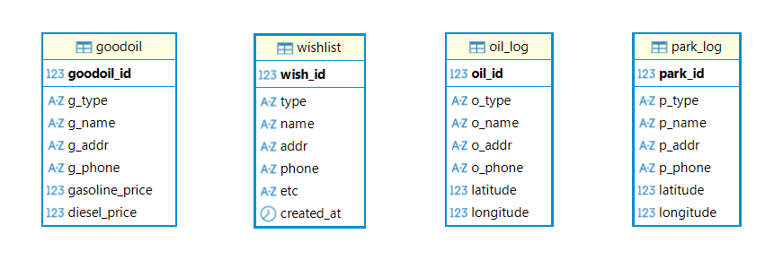

## SKN34-1st-2Team

# 전국 주유소 및 주차장 조회 시스템

## 👥 팀 소개
| 이현준 | 김기호 | 김현지 | 송승재 |
|:----------:|:----------:|:----------:|:----------:|
|<br>|<br>|Database 설계 및 연동<br>데이터 저장|<br>|
| [GitHub](https://github.com/gksrkd2) | [GitHub](https://github.com/kyo-135) | [GitHub](https://github.com/HJK013) | [GitHub](https://github.com/Genus-Jae) |

## 📋 프로젝트 개요
> 개발 기간 : 2026.06.26 - 2026.07.03
### 1) 프로젝트명
전국 주유소 및 주차장 조회 시스템
### 2) 프로젝트 소개
- 전국 공영/민영 주차장 데이터와 전국 주유소 데이터를 기반으로 하여, 각 주차장과 주유소의 위치와 정보를 조회할 수 있도록 구현하였습니다.  
- 착한 주유소 조회 기능을 통해 착한 주유소로 조회되는 지점의 유가정보를 제공합니다.
### 3) 프로젝트 필요성
- 전국의 주차장/주유소 데이터를 지도와 주소 기반으로 조회할 수 있는 화면 구성
- 지점 즐겨찾기 기능으로 사용자가 즐겨찾는 지점만 조회 가능 
### 4) 프로젝트 목표
- 주차장과 주유소의 정확한 위치를 지도에 노출
- 착한 주유소에 해당되는 지점의 유가 정보를 노출
- 사용자가 특정 지점 즐겨찾기 등록
- 자주 묻는 질문 통합 조회
## 🔨 기술 스택
* **Language:** `Python 3.12.10`
* **Database:** `MySQL` 
* **Web Framework:** `Streamlit`

## 🗂️ 폴더구조
```
project_1st/
├─ assets/ - 미디어 파일(이미지, 동영상 등)
├─ components/ - 재사용 가능한 컴포넌트(UI)
│  └─ sample.py
├─ data/ - 데이터 파일(csv, json 들)
├─ docs/ - README 리소스
├─ pages/ - 화면 구성
│  ├─ main.py
│  └─ sample1.py
├─ services/ - 데이터 처리 및 핵심 로직
│  └─ sample.py
├─ utils/ - 공통 함수
├─ .gitignore
├─ app.py - 기본 실행 파일
├─ config.py - 환경설정 및 전역 변수 관리
├─ README.txt
└─ requirements.txt
```

## ⚙️ ERD
**<주요 테이블 관계>**  
`goodoil` : 착한 주유소 저장 테이블로 이름, 주소, 전화번호, 가격정보 등 저장  
`wishlist` : 즐겨찾기 저장 테이블로 주유소/주차장 타입, 이름, 주소, 전화번호 등 저장  
`oil_log`, `park_log`: 주차장과 주유소 데이터를 저장  
  

| 컬럼명 | 데이터 타입 | Null | Key | Default | Extra |
| :--- | :--- | :--- | :--- | :--- | :--- |
| goodoil_id | int | NO | PRI | [NULL] | auto_increment |
| g_type | varchar(3) | YES | | o | |
| g_name | varchar(100) | NO | | [NULL] | |
| g_addr | varchar(255) | YES | UNI | [NULL] | |
| g_phone | varchar(50) | YES | | [NULL] | |
| gasoline_price | int | YES | | [NULL] | |
| diesel_price | int | YES | | [NULL] | |   

| 컬럼명 | 데이터 타입 | Null | Key | Default | Extra |
| :--- | :--- | :--- | :--- | :--- | :--- |
| wish_id | int | NO | PRI | [NULL] | auto_increment |
| type | varchar(3) | YES | | [NULL] | |
| name | varchar(100) | NO | | [NULL] | |
| addr | varchar(255) | YES | | [NULL] | |
| phone | varchar(50) | YES | | [NULL] | |
| etc | varchar(100) | YES | | [NULL] | |
| created_at | timestamp | YES | | CURRENT_TIMESTAMP | DEFAULT_GENERATED |   

| 컬럼명 | 데이터 타입 | Null | Key | Default | Extra |
| :--- | :--- | :--- | :--- | :--- | :--- |
| oil_id | int | NO | PRI | [NULL] | auto_increment |
| o_type | varchar(3) | YES | | o | |
| o_name | varchar(100) | NO | | [NULL] | |
| o_addr | varchar(255) | YES | UNI | [NULL] | |
| o_phone | varchar(50) | YES | | [NULL] | |
| latitude | double | YES | | [NULL] | |
| longitude | double | YES | | [NULL] | |    

| 컬럼명 | 데이터 타입 | Null | Key | Default | Extra |
| :--- | :--- | :--- | :--- | :--- | :--- |
| park_id | int | NO | PRI | [NULL] | auto_increment |
| p_type | varchar(3) | YES | | p | |
| p_name | varchar(100) | NO | | [NULL] | |
| p_addr | varchar(255) | YES | UNI | [NULL] | |
| p_phone | varchar(50) | YES | | [NULL] | |
| latitude | double | YES | | [NULL] | |
| longitude | double | YES | | [NULL] | |  


## 📰 사용 데이터
- 공공데이터포털  
  - [전국주차장정표준데이터](https://www.data.go.kr/data/15012896/standard.do#/layer_data_infomation)
  - [전국주유소표준데이터](https://www.data.go.kr/data/15129441/standard.do)
- 오피넷


## 📌 수행결과


## 💭 한 줄 회고
> **이현준**  
내용

> **김기호**  
내용

> **김현지**  
직접 테이블을 생성하고 다량의 비정형 데이터를 적재하며 중복 데이터나 예외 상황 등의 오류들도 발생하였으나, 하나씩 수정해 나가는 과정을 통해 성장할 수 있었던 첫 프로젝트였습니다.

> **송승재**  
내용